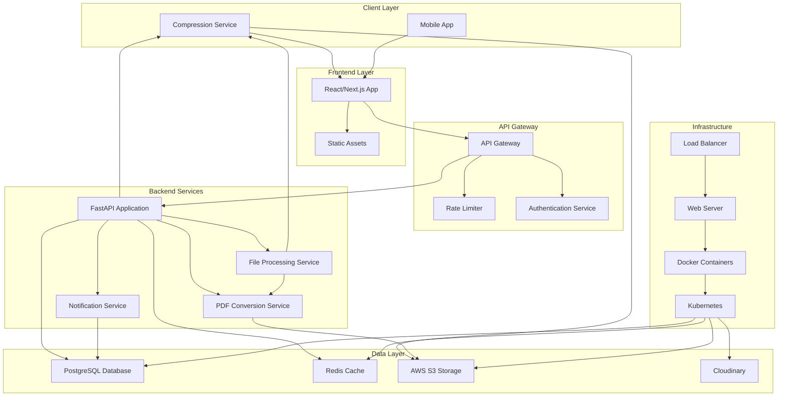

# To Kit - System Architecture

## Overview
To Kit is a full-stack SaaS platform for file compression and productivity utilities. The system is designed to be scalable, secure, and production-ready with modern web technologies.

## System Architecture Diagram

## Technology Stack

### Frontend
- **Framework**: Next.js 14 (React 18)
- **Styling**: Tailwind CSS + CSS Modules
- **State Management**: Zustand + React Query
- **UI Components**: Headless UI + Custom Design System
- **Build Tool**: Vite
- **Deployment**: Vercel

### Backend
- **Framework**: FastAPI (Python 3.11+)
- **Async Support**: Built-in async/await
- **ORM**: SQLAlchemy + Alembic
- **Validation**: Pydantic
- **Background Tasks**: Celery + Redis
- **Testing**: Pytest + Hypothesis

### Database
- **Primary**: PostgreSQL 15
- **Cache**: Redis 7
- **Search**: PostgreSQL Full-Text Search

### File Storage
- **Primary**: AWS S3 (Standard)
- **CDN**: CloudFront
- **Image Optimization**: Cloudinary
- **Backup**: S3 Glacier

### Infrastructure
- **Containerization**: Docker
- **Orchestration**: Kubernetes
- **CI/CD**: GitHub Actions
- **Monitoring**: Prometheus + Grafana
- **Logging**: ELK Stack

## Microservices Architecture

### Core Services
1. **Authentication Service**: JWT-based auth with refresh tokens
2. **File Processing Service**: Handles file uploads, processing, and storage
3. **Compression Service**: Image and PDF compression algorithms
4. **Conversion Service**: Image-to-PDF conversion
5. **User Service**: User management and profile handling
6. **Notification Service**: Email and in-app notifications
7. **Billing Service**: Subscription management (future)

### Service Communication
- **Internal APIs**: FastAPI endpoints with OpenAPI documentation
- **Message Queue**: Redis for task queuing
- **Event Streaming**: Redis Pub/Sub for real-time updates
- **Database**: Shared PostgreSQL with proper isolation

## Security Architecture

### Authentication & Authorization
- **JWT Tokens**: Access tokens (15 min) + Refresh tokens (7 days)
- **Password Hashing**: bcrypt with salt
- **Multi-factor Authentication**: TOTP (future)
- **Role-Based Access Control**: Admin, User, Guest roles

### Data Protection
- **Encryption**: AES-256 for sensitive data
- **SSL/TLS**: HTTPS everywhere
- **CSP Headers**: Content Security Policy
- **Rate Limiting**: Per-user and per-IP limits

### API Security
- **CORS**: Configured for allowed origins
- **Input Validation**: Pydantic schemas
- **SQL Injection Prevention**: SQLAlchemy ORM
- **XSS Protection**: Content sanitization

## Scalability Design

### Horizontal Scaling
- **Stateless Services**: All services are stateless
- **Load Balancer**: Nginx with health checks
- **Auto-scaling**: Kubernetes HPA based on CPU/memory
- **Database**: Read replicas for scaling reads

### Performance Optimization
- **Caching**: Redis for frequently accessed data
- **CDN**: CloudFront for static assets
- **Compression**: Gzip/Brotli for API responses
- **Database**: Connection pooling and query optimization

### Monitoring & Observability
- **Metrics**: Prometheus for system metrics
- **Logging**: Structured logging with ELK
- **Tracing**: OpenTelemetry for distributed tracing
- **Alerting**: Prometheus Alertmanager

## Deployment Architecture

### Environment Setup
- **Development**: Local Docker Compose
- **Staging**: Kubernetes cluster
- **Production**: Multi-region Kubernetes

### CI/CD Pipeline
1. **Code Quality**: Pre-commit hooks + linters
2. **Testing**: Unit + Integration + E2E tests
3. **Security**: SAST + Dependency scanning
4. **Deployment**: Blue-green deployments

### Disaster Recovery
- **Backups**: Automated database backups
- **Failover**: Multi-region setup
- **Monitoring**: 24/7 system monitoring
- **Incident Response**: Runbooks and on-call rotation

## Development Workflow

### Branching Strategy
- **Main**: Production-ready code
- **Develop**: Integration branch
- **Feature**: Feature-specific branches
- **Hotfix**: Critical bug fixes

### Code Review Process
- **Pull Requests**: Required for all changes
- **Automated Checks**: CI/CD validation
- **Manual Review**: Architecture and security review
- **Testing**: Comprehensive test coverage

### Documentation
- **API Docs**: OpenAPI/Swagger auto-generated
- **Architecture**: Architecture Decision Records (ADRs)
- **Code**: Type hints and docstrings
- **Operations**: Runbooks and playbooks

## Future Scalability

### Feature Roadmap
1. **Phase 1**: Core compression features
2. **Phase 2**: Advanced file processing
3. **Phase 3**: Collaboration features
4. **Phase 4**: Enterprise features

### Technology Evolution
- **Serverless**: Lambda functions for specific tasks
- **Edge Computing**: Cloudflare Workers for global processing
- **AI/ML**: Intelligent file optimization
- **Real-time**: WebSocket support for live processing

This architecture provides a solid foundation for building a scalable, secure, and maintainable SaaS platform that can grow with user demands and evolving technology trends.